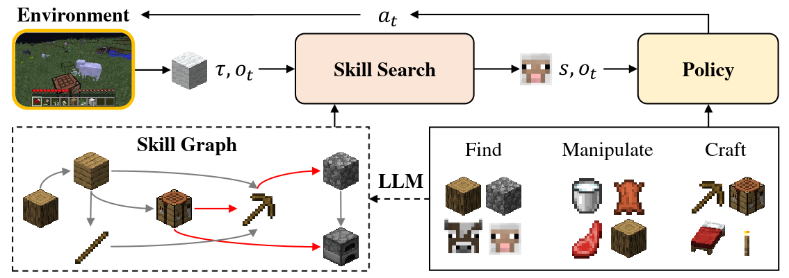

# Plan4MC: Skill Reinforcement Learning and Planning for Open-World Minecraft Tasks
<div align="center">

[[Website]](https://sites.google.com/view/plan4mc) 
[[Arxiv Paper]](https://arxiv.org/abs/2303.16563)

[](https://pypi.org/project/MineDojo/)
[](https://pytorch.org/)
______________________________________________________________________

</div>

Plan4MC is a multi-task agent in Minecraft, solving long-term tasks via planning over basic skills. It  acquire three types of fine-grained basic skills through reinforcement learning without demonstrations. With a skill graph pre-generated by the Large Language Model, the skill search algorithm generates skill plans and interactively selects policies to solve complicated tasks. Plan4MC accomplishes 24 diverse hard tasks in Minecraft.

## Installation

- Install MineDojo environment following the [official document](https://docs.minedojo.org/sections/getting_started/install.html#prerequisites).  It requires python >= 3.9. We install jdk 1.8.0_171.

- Upgrade the MineDojo package: 
	- Delete the original package `pip uninstall minedojo`.
	- Download our [forked MineDojo repository](https://github.com/YHQpkueecs/MineDojo). Run `python setup.py install`.
	- To this end, you can successfully run `validate_install.py` [here](https://github.com/MineDojo/MineDojo/tree/main/scripts).

- Install python packages in `requirements.txt`. Note that we require PyTorch>=1.8.1 and x-transformers==0.27.1.

- Download the [pretrained MineCLIP model](https://drive.google.com/file/d/1uaZM1ZLBz2dZWcn85rZmjP7LV6Sg5PZW/view?usp=sharing) named `attn.pth`.  Move the file to `mineclip_official/`.

## Tasks
- We provide 24 diverse tasks configured in `envs/hard_task_conf.yaml`.  To create an environment for a task:
```python
from envs.minecraft_hard_task import MinecraftHardHarvestEnv
from minedojo.sim import InventoryItem
import utils
task_name = 'harvest_mutton_with_diamond_sword'
task_conf = utils.get_yaml_data('envs/hard_task_conf.yaml')[task_name]
init_items = {}
if 'initial_inventory' in task_conf:
    init_items = task_conf['initial_inventory']
    init_inv = [InventoryItem(slot=i, name=k, variant=None, quantity=task_conf['initial_inventory'][k]) for i,k in enumerate(list(task_conf['initial_inventory'].keys()))]
    task_conf['initial_inventory'] = init_inv
env = MinecraftHardHarvestEnv(image_size=(160,256), **task_conf)
```

- To generate task names, initial plans and involved skills for all the tasks, run `python plan_all_tasks.py`.


## Plan4MC
- Pre-trained models for skills are released in `skills/models/`.
- To test Plan4MC on the task 'get_furnace_nearby_with_logs' as an example,  run `python test.py --task get_furnace_nearby_with_logs`.   Arguments:

	\-\-task:  available tasks are listed in `envs/hard_task_conf.yaml`.

	\-\-save-path: output directory for testing results.

	\-\-test-episode: number of testing episodes.

	\-\-save-gif: set to 1 to save testing videos.

## Citation
```bibtex
@article{yuan2023plan4mc,
      title={{Plan4MC}: Skill Reinforcement Learning and Planning for Open-World {Minecraft} Tasks}, 
      author={Yuan, Haoqi and Zhang, Chi and Wang, Hongcheng and Xie, Feiyang and Cai, Penglin and Dong, Hao and Lu, Zongqing},
      journal={arXiv preprint arXiv:2303.16563},
      year={2023},
}
```

